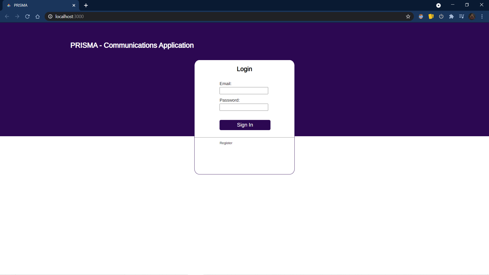
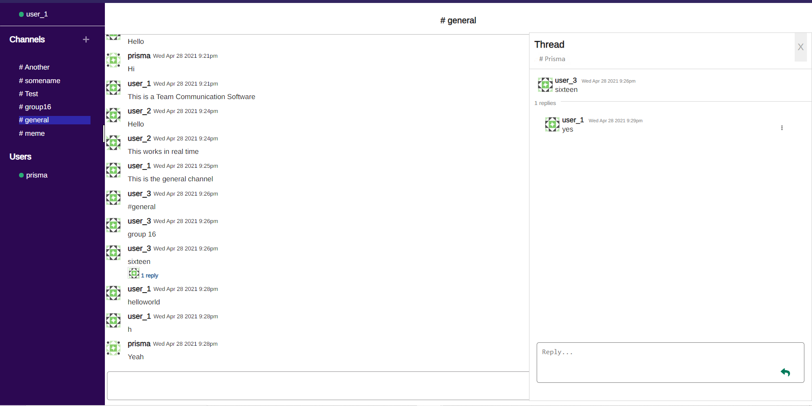
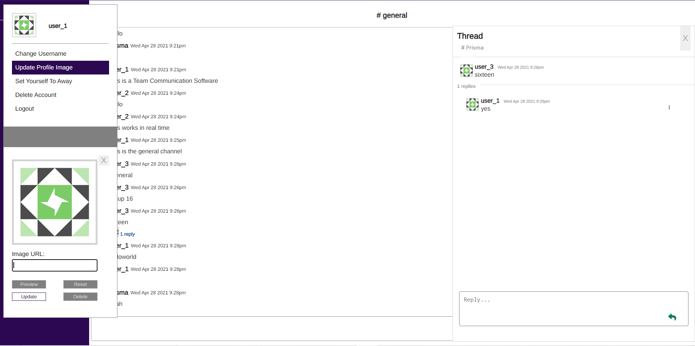
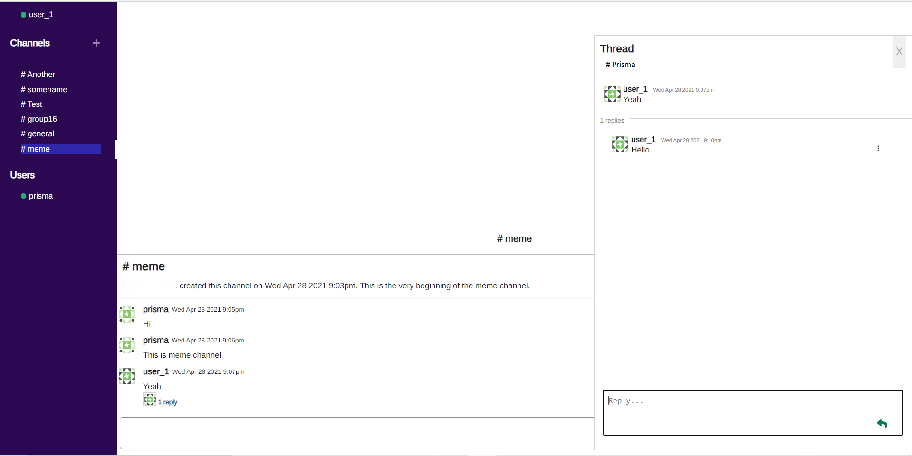
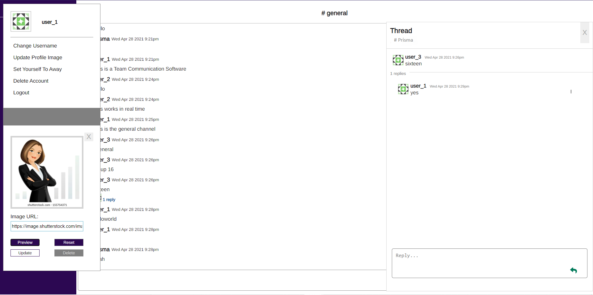

# Prisma-For-Professional-Teamwork


# Prisma

> Team Communications Software

## Table of Contents

- [Description](#description)
- [Installation](#installation)
- [Screenshots](#screenshots)
- [Technology](#technology)


## Description

> This is a team communications app.  A user can register, login, start a new channel, start a new thread, leave comments, update their name and even change their profile image.


## Installation


### Setup

> install node packages in back-end

```shell
$ cd prisma-backend 
$ npm install
```

>now install node packages for front-end

```shell
$ cd prisma-frontend
$ npm install
```

### Run Locally

- Run front end and back end. Front end runs on port 3000, while server runs on port 8080.

```shell
$ npm start
```

---


## Screenshots










---

# Technology

 - React
 - Express
 - MongoDB w/ Mongoose
 - Node.js
 - Socket.io
 - Passport.js
 - JWT Token
 - Bcrypt
